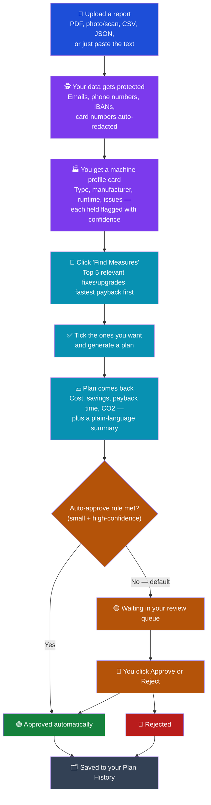

# maintain-agent

**AI Maintenance Planner for Industry 4.0** — turns maintenance reports into structured machine data, matches best-practice measures, and generates ROI-backed project plans.

[](https://github.com/m-ahmedbashir/maintain-agent/actions/workflows/ci.yml)
[](LICENSE)


[](CONTRIBUTING.md)

## Contents

- [Overview](#overview)
- [How It Works](#-how-it-works)
- [Features](#-features)
- [Architecture](#-architecture)
- [Tech Stack](#-tech-stack)
- [Getting Started](#%EF%B8%8F-getting-started)
- [The Magic Inside the Code](#-the-magic-inside-the-code)
- [Deployment](#-deployment)
- [Contributing](#-contributing)
- [Acknowledgments](#-acknowledgments)
- [License](#-license)
- [About the Author](#-about-the-author)

## Overview

Factories still review maintenance reports and plan retrofits in spreadsheets — slow, error-prone, and impossible to scale. **maintain-agent** automates that step without removing the human: it extracts structured machine data from PDFs, matches best-practice industrial maintenance measures, and generates ROI-backed project plans behind a **Human-in-the-Loop (HITL)** governance layer.

Upload a German maintenance report (PDF, image, or pasted text), and the agent uses the **Vercel AI SDK** with a provider-agnostic model registry to extract a machine profile, query a curated measure database, and produce a Zod-validated project plan with German executive summaries for plant managers. Every field carries a six-anchor confidence score, and high-value plans stay in draft until a human approves them.

The repo is a `pnpm` + Turborepo monorepo: a **Next.js** frontend (Clerk auth, maintenance dashboard, chat assistant) and a **NestJS** backend (Prisma/PostgreSQL, extraction and planning pipelines, PII compliance masking). Every push and PR runs a real CI pipeline (typecheck + test across all workspaces) — the badge above reflects the actual current state of `main`, not an aspiration.

---

## 🔄 How It Works

What you actually do, and what you get back, from "I have a PDF" to "the retrofit is approved":



A couple of things that don't show up in the boxes above: you can bring your own Groq/OpenAI/Anthropic API key in Settings instead of using the app's shared free one (encrypted at rest, never shown back to you), there's a chat assistant on the Chat page if you'd rather just ask questions about a machine or plan instead of clicking through the flow above, and a Live Monitoring screen offers a second way into the same flow — a machine's live-detected issues land in the same profile a document upload would, so "Click Find Measures" in step 4 works identically either way.

---

## 🚀 Features

### 🟢 Current Features

- **Multimodal extraction for maintenance reports.** Text, CSV, JSON, PDF, and images (PNG/JPEG/WebP) are all accepted. Images can go straight to a vision-capable model (default), or be processed locally via Tesseract OCR on the server before model delivery to ensure local PII masking. PDFs try a text-layer extraction first (`pdf-parse`); if a PDF has no real text — a scanned/image-only document — up to its first 5 pages are rendered to PNGs server-side and either processed via local OCR or sent as separate image blocks through the vision path, depending on the user's selected Processing Mode.
- **PII masking before anything leaves the server, closing the image-PII gap.** An ordered regex pipeline (IBAN → card → email → VAT → phone) strips sensitive tokens out of any text content *before* it's sent to the model. With Local OCR mode, image pixels are converted to text locally on the server first, allowing the exact same PII-masking pipeline to redact sensitive data before any network request is made. For vision mode, the prompt asks the model to report any visible PII, generating an `imagePiiDetected` warning.
- **Confidence as six fixed anchors.** The extraction prompt forces exactly `1.0 / 0.8 / 0.6 / 0.4 / 0.2 / 0.0`, each with a written rubric, so a score means the same thing every time.
- **Industrial maintenance domain models.** Shared Zod schemas (`MachineProfile`, `Measure`, `ProjectPlan`) are consumed by both backend and frontend; `.strict()` rejects hallucinated extra fields.
- **Measure matching.** Given a machine profile, the backend filters a seeded database of German industrial measures by machine type and minimum runtime, then returns the top 5 fastest-payback measures.
- **AI-generated project plans.** All financials (investment, savings, payback, CO₂ reduction, confidence) are computed deterministically from the selected measures — the model (the same free OpenRouter default used for extraction) is only asked to write the German executive summary and an English backup, so a malformed model response can never corrupt the plan's numbers. If the model's JSON fails to parse, the raw text is used as a fallback rather than failing the plan.
- **HITL plan governance.** A per-user `planApprovalMode` setting (`MANUAL_REVIEW` / `AUTO_APPROVE`) gates whether low-investment/high-confidence plans are auto-approved or held for manual review. `POST /maintenance/plans/:id/approve` and `POST /maintenance/plans/:id/reject` log the decision.
- **Defense-in-depth uploads.** Files are buffered in memory only (never written to disk), and MIME type/size are validated independently at three layers (Multer, the NestJS pipe, and an in-service allowlist) before any processing starts.
- **Real observability.** Every extraction attempt writes an `ExtractionLog` row. The `/maintenance/stats` endpoint runs Prisma aggregate queries concurrently via `Promise.all` and reports success rate, average confidence, top machine types, OCR usage rate, and vision usage rate.
- **A provider-agnostic model registry.** Extraction and planning use a small registry (`model-registry.ts`) mapping keys to Groq, OpenAI, or Anthropic, with vision-capability tracking so a text-only model can't silently be sent an image.
- **BYOK — bring your own provider key, encrypted at rest.** A user can save their own Groq/OpenAI/Anthropic key in Settings instead of using the app's shared one. AES-256-GCM authenticated encryption, with decryption happening server-side immediately before the provider call.
- **Carbon-aware planning.** Before writing the executive summary, the planner pulls live German grid carbon intensity from [Electricity Maps](https://www.electricitymaps.com) and — when available — asks the model to factor it into scheduling advice (e.g. run energy-intensive work during low-carbon hours). Purely additive: the token is optional, a failed/missing call is silently omitted from the prompt, and the number never touches any computed financial.
- **Live Monitoring.** A per-machine live-telemetry screen at `/dashboard/maintenance/live` — seeded automatically with demo machines on a new account's first visit, or added manually via a quick 4-field form, so it never requires a document upload first. Readings are explicitly disclosed as simulated (re-baselined from a real public live feed around each machine's own profile, not presented as real sensor data), and any detected anomaly is written straight into that machine's `observedIssues`, so it flows through the exact same Find Measures → Plan pipeline a document-derived issue would.
- **Demo reports.** Three synthetic German maintenance reports are included in `demo-data/`, both as Markdown source and pre-rendered PDF, for quick end-to-end testing.

### 🔵 Roadmap

**Near-term:**
- Fix frontend linting: `next lint` no longer exists as of Next.js 16, and the legacy `.eslintrc.json` also fails under the installed ESLint version.
- Field-by-field streaming of extraction results into the review card using `useObject`.
- Multi-step agentic tool loops in the chat assistant.
- Embeddings over stored machine profiles and plans for semantic search.

**Mid-term:**
- CSV/export reporting and webhook emitter for downstream ERP systems.
- Fine-grained Clerk permissions (PBAC — who can approve vs. who can only view plans).
- OpenTelemetry tracing around the extraction and planning pipelines.

**Stretch:**
- Queue-based batch processing (BullMQ) for bulk report uploads.
- Docker/devcontainer setup for one-command onboarding.

---

## 🏗 Architecture

```text
maintain-agent/
├── .github/
│   ├── workflows/ci.yml        # typecheck + test on every push/PR
│   ├── ISSUE_TEMPLATE/
│   └── PULL_REQUEST_TEMPLATE.md
├── apps/
│   ├── frontend/       # Next.js app — dashboard, chat assistant, maintenance UI
│   └── backend/        # NestJS API
│       └── src/modules/
│           ├── extraction/           # Generic extraction pipeline (PDF, OCR, vision, model registry)
│           ├── compliance/           # PII masking
│           ├── carbon/               # Live grid carbon intensity (Electricity Maps)
│           ├── telemetry/            # Simulated live machine telemetry + anomaly detection
│           ├── maintenance/          # Maintenance report extraction, matching, planning
│           │   ├── maintenance-extraction.service.ts
│           │   ├── matching.service.ts
│           │   └── planning.service.ts
│           └── users/                # Per-user plan approval/model settings
├── packages/
│   └── shared/         # @maintain/shared — Zod schemas and shared types
├── demo-data/        # Synthetic German maintenance reports (Markdown + PDF)
├── turbo.json           # build/test/typecheck pipeline across all workspaces
├── LICENSE
├── CONTRIBUTING.md
└── CODE_OF_CONDUCT.md
```

---

## 🛠 Tech Stack

- **AI:** Vercel AI SDK 6 via a provider-agnostic model registry — OpenRouter (`nvidia/nemotron-nano-12b-v2-vl:free` free-vision default, used for both extraction and planning), Groq (`compound-mini` free text), OpenAI, and Anthropic wired in and ready to select
- **Validation:** Zod, `nestjs-zod`
- **Document parsing:** `pdf-parse` (PDF text-layer extraction + `@napi-rs/canvas` rasterization fallback)
- **Frontend:** Next.js, `@ai-sdk/react` (`useChat`), Tailwind CSS, shadcn/ui, `react-virtuoso`
- **Backend:** NestJS, Prisma, PostgreSQL
- **Auth:** Clerk
- **Live data:** [Electricity Maps](https://www.electricitymaps.com) (grid carbon intensity), ThingSpeak (public live feed powering simulated machine telemetry)
- **Industrial maintenance domain models:** `MachineProfile`, `Measure`, `ProjectPlan`
- **Workspaces/Tooling:** pnpm, Turborepo, GitHub Actions

---

## ⚙️ Getting Started

### Prerequisites

- [Node.js](https://nodejs.org/) (v18+)
- [pnpm](https://pnpm.io/installation) (v10+)
- A PostgreSQL database (e.g. a free [Neon](https://neon.tech) or [Railway](https://railway.app) instance)

### Installation

```bash
git clone https://github.com/m-ahmedbashir/maintain-agent.git
cd maintain-agent
pnpm install
```

### Environment Variables

**Backend (`apps/backend/.env`):**

```bash
cd apps/backend
cp .env.example .env
```

Set `GROQ_API_KEY` (free, no card required, from [console.groq.com](https://console.groq.com)) and `DATABASE_URL` (your PostgreSQL connection string).

**Frontend (`apps/frontend/.env`):**

```bash
cd apps/frontend
cp .env.example .env
```

Leave the Clerk keys empty to use Clerk's keyless dev mode, or populate `NEXT_PUBLIC_CLERK_PUBLISHABLE_KEY` / `CLERK_SECRET_KEY` from your Clerk dashboard.

### Database

```bash
cd apps/backend
pnpm prisma migrate dev --name add_maintenance_domain
```

(The Prisma client is also regenerated automatically on every `pnpm install` via a `postinstall` hook — you don't need to run `prisma generate` by hand.)

### Seed Measures

After migrating, insert the curated German industrial maintenance measures:

```bash
pnpm db:seed
```

### Running Locally

```bash
pnpm dev              # both apps via Turborepo
# or individually:
pnpm dev:frontend
pnpm dev:backend
```

### Running Tests & Typecheck

```bash
pnpm test         # all workspaces — same command CI runs
pnpm run typecheck  # tsc --noEmit across every workspace
```

---

## 🧑‍💻 The Magic Inside the Code

**Extraction — masked text (and/or a raw image) in, a Zod-validated MachineProfile out:**

```typescript
import { generateObject } from 'ai';
import { resolveModel, MODEL_REGISTRY, DEFAULT_MODEL_KEY } from './model-registry';
import { MachineProfileSchema } from '@maintain/shared';

const modelDescriptor = MODEL_REGISTRY[modelKey];
if (imageBuffer && !modelDescriptor.supportsVision) {
  throw new Error(`${modelDescriptor.modelId} doesn't support image input`);
}

// PII is masked before this point — maskedText never contains the raw input
const { object } = await generateObject({
  model: resolveModel(modelKey ?? DEFAULT_MODEL_KEY),
  schema: MachineProfileSchema,
  messages: [{
    role: 'user',
    content: [
      { type: 'text', text: extractionPrompt },
      ...(maskedText ? [{ type: 'text', text: maskedText }] : []),
      ...(imageBuffer ? [{ type: 'image', image: imageBuffer, mimeType }] : []),
    ],
  }],
});

// object is already validated against MachineProfileSchema
```

**Matching — best-practice measures for the machine:**

```typescript
const measures = await matchingService.findMeasures(machineProfile);
// filters by machineType and minRuntimeHours, sorts by paybackMonths, returns top 5
```

**Planning — ROI-backed project plan with German executive summary:**

```typescript
const plan = await planningService.generatePlan(machineProfile, selectedMeasures, userId);
// financials computed deterministically; model only writes the executive summary;
// persists a Plan row with a real DB id and applies HITL auto-approve rules
```

**Human-in-the-loop — an agent can propose a plan, but can't execute one without a click:**

```typescript
const { messages, addToolApprovalResponse, addToolOutput } = useChat({
  transport: new DefaultChatTransport({ api: '/api/chat' }),
});

// Approve or reject a drafted plan via dedicated endpoints
async function onApprove(planId: string) {
  await fetch(`/maintenance/plans/${planId}/approve`, { method: 'POST' });
}
```

---

## 🚀 Deployment

- **Frontend (Vercel):** Build: `pnpm build --filter=@maintain/frontend`
- **Backend (Railway):** Build: `pnpm build --filter=@maintain/backend`

(This is separate from the [CI workflow](.github/workflows/ci.yml) above, which typechecks and tests every push/PR — it doesn't deploy anything.)

---

## 🤝 Contributing

Issues and PRs are genuinely welcome. Before opening one:

- Read [CONTRIBUTING.md](CONTRIBUTING.md) — it covers setup, the pre-PR checklist (`pnpm run typecheck` + `pnpm test`, the same commands CI runs), and a short list of concrete good-first-issues pulled straight from this README's own Roadmap.
- This project follows the [Contributor Covenant Code of Conduct](CODE_OF_CONDUCT.md).
- Bug reports and feature requests have templates under `.github/ISSUE_TEMPLATE/`; PRs get a checklist template automatically.

## 🙏 Acknowledgments

The frontend started from [next-shadcn-dashboard-starter](https://github.com/Kiranism/next-shadcn-dashboard-starter) by [Kiranism](https://github.com/Kiranism) (dashboard shell, shadcn/ui setup, auth scaffolding) — since substantially extended with the maintenance extraction pipeline, chat assistant, and review UI described above.

Built with Vercel AI SDK, Zod, and Human-in-the-Loop governance patterns.

## 📄 License

[ISC](LICENSE) — see the [LICENSE](LICENSE) file for the full text.

## 👤 About the Author

Built by **Ahmed Bashir** — a full-stack engineer working across TypeScript, React, and Node.js, currently based in Bielefeld, Germany, and studying Intelligent Interactive Systems (AI/NLP focus) at Bielefeld University.

This repo is the most complete example of how I think about shipping AI-agent features: type safety at the boundary, a human in the loop on anything consequential, and a habit of finding and fixing my own gaps.

- GitHub: [github.com/m-ahmedbashir](https://github.com/m-ahmedbashir)
- Project: [github.com/m-ahmedbashir/maintain-agent](https://github.com/m-ahmedbashir/maintain-agent)
- LinkedIn: [linkedin.com/in/ahmed-bashir-2118651aa](https://www.linkedin.com/in/ahmed-bashir-2118651aa/)

Questions, feedback, or a role you think this'd be a good fit for — open an issue, or reach out directly.
