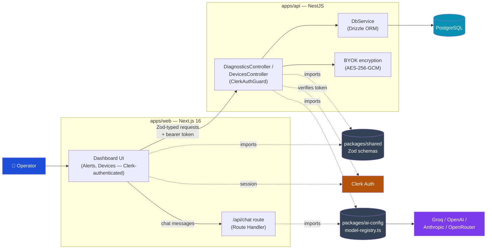
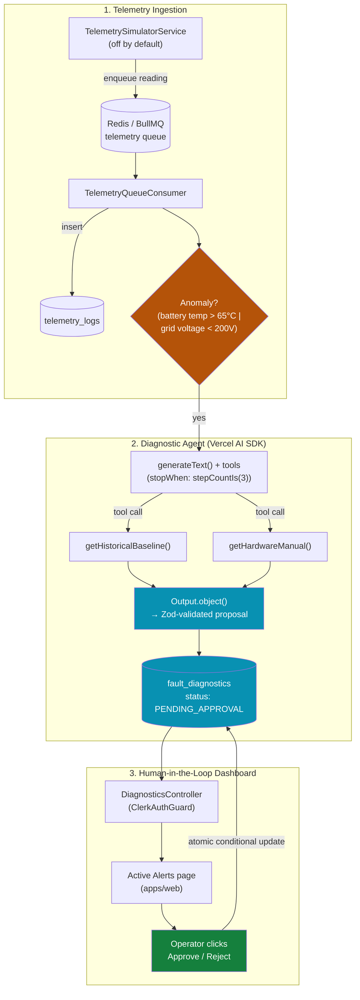

# gridstream-agent

**An event-driven IoT telemetry & Virtual Power Plant (VPP) diagnostic pipeline for green-tech energy assets** — solar, battery storage, heat pumps, EV wallboxes.

[](https://github.com/m-ahmedbashir/gridstream-agent/actions/workflows/ci.yml)
[](LICENSE)


[](CONTRIBUTING.md)

## Contents

- [System Architecture](#%EF%B8%8F-system-architecture)
- [Where this project is right now](#-where-this-project-is-right-now)
- [How a fault gets diagnosed and approved](#-how-a-fault-gets-diagnosed-and-approved)
- [Building an AI feature here](#-building-an-ai-feature-here)
- [Tech Stack](#-tech-stack)
- [Repo Structure](#-repo-structure)
- [Getting Started](#%EF%B8%8F-getting-started)
- [Deployment](#-deployment)
- [Contributing](#-contributing)
- [License](#-license)
- [About the Author](#-about-the-author)

## 🏗️ System Architecture

The app-level wiring — auth, data access, the shared packages. See "How a fault gets diagnosed and approved" below for the actual telemetry→diagnosis→approval pipeline.



The ingestion → diagnosis → approval pipeline behind this diagram is its own flow — see the next section.

---

## 📍 Where this project is right now

The full loop works end to end: a telemetry anomaly triggers the diagnostic agent, the agent produces a `FaultDiagnostic` sitting at `PENDING_APPROVAL`, and an operator can see it in the dashboard and approve or reject it.

**What's live today:**
- Clerk authentication on the frontend; real backend session verification (`ClerkAuthGuard`, via `@clerk/backend`) on the two dashboard-facing controllers
- A per-user settings model (model preference, BYOK provider key) backed by Postgres via Drizzle ORM
- A provider-agnostic AI model registry (`packages/ai-config/src/model-registry.ts`), shared by both apps — swap Groq/OpenAI/Anthropic/OpenRouter without touching a single feature's code
- AES-256-GCM encryption for user-supplied API keys
- A Redis/BullMQ telemetry ingestion pipeline with a simulator (off by default) generating plausible per-device readings, including occasional injected anomalies
- The diagnostic agent (`apps/api/src/modules/diagnostics/`) — investigates a safety-bound breach via tool calls, then emits a schema-validated `FaultDiagnostic` proposal
- The Active Alerts dashboard — a status-filtered queue of `FaultDiagnostic` records with Approve/Reject actions, and a Devices overview listing the fleet

**What's not built yet:**
- Telemetry charts / a device-detail view (drill into one device's history) — the Devices page is a flat list today
- Severity-based auto-triage — every diagnosis goes to `PENDING_APPROVAL` regardless of severity; there's no "auto-log a routine ticket, only escalate CRITICAL ones" branch
- Broader backend authorization — `ClerkAuthGuard` checks for *a* valid session, not role/permission (any authenticated user can approve/reject); no Postgres RLS
- Frontend test coverage — the backend has extensive Jest coverage, the frontend has none yet

[REFACTOR_PROGRESS.md](REFACTOR_PROGRESS.md) is the living, dated log of what's been built stage-by-stage — read it for the full history and reasoning behind each decision.

---

## 🔄 How a fault gets diagnosed and approved



The load-bearing constraint end to end: **the model never computes a number that gets acted on, and nothing consequential executes without a human clicking Approve.** `status` is always set deterministically by the service — `PENDING_APPROVAL` on creation, `APPROVED`/`REJECTED` only via an explicit operator action — never taken from the model's own output. A failed diagnosis (provider outage, no API key configured) is swallowed at the trigger boundary rather than failing the whole ingestion job, since the triggering telemetry reading is already persisted by that point and BullMQ would otherwise retry and duplicate it.

---

## 🧩 Building an AI feature here

This section exists so the folder structure for the next AI-calling feature isn't reinvented from scratch, and so it stays consistent as the codebase grows. It's also documented in [AGENTS.md](AGENTS.md) for coding agents working in this repo — this is the human-readable version.

### Start simple, add orchestration only when the task demands it

Most features in this codebase are, and should stay, a **single augmented call**: a prompt, the tools it needs, and a Zod schema constraining the output. Reach for a multi-step agent loop only when the model genuinely has to decide *which* tools to call and in *what order* for a problem whose steps can't be predicted ahead of time — not by default, and not because a loop looks more sophisticated than a function call. An unnecessary agent loop is more surface area to get wrong for a job a single structured call would already do.

### The folder shape for a new AI-calling module

Reference implementation: `apps/api/src/modules/diagnostics/` — the agent behind the diagram above.

```
apps/api/src/modules/<feature>/
  <feature>.module.ts
  <feature>.controller.ts        # HTTP surface, if it has one — diagnostics/ doesn't: it's triggered
                                  # internally via DI (telemetry-ingestion calls it), not by a request
  <feature>.service.ts           # orchestration: builds the prompt, calls generateObject() or
                                  # generateText()+tools, returns the validated result
  <feature>.service.spec.ts      # mock the AI SDK call itself (jest.mock('ai')), not just its inputs
  tools/
    <tool-name>.tool.ts          # one file per tool: a pure function + its own Zod input schema
    <tool-name>.tool.spec.ts     # pure functions — test them without ever touching the LLM
```

The output schema (what the model must return) and any request/response DTOs live in `packages/shared`, not inline in the service — one definition, imported by the backend to bind the AI call *and* by the frontend to type whatever renders the result. Where the shape is a subset of an existing table (a diagnosis proposal is most of `FaultDiagnostic`, minus the fields the service fills in itself), derive it with `.pick()` off the table's schema instead of writing a parallel one. See [AGENTS.md](AGENTS.md#type-safety--single-source-of-truth-for-schemas) for the full single-source-of-truth rule.

### Rules that don't bend

- **One model registry, always, shared by both apps.** `packages/ai-config/src/model-registry.ts` is the only place a provider SDK gets imported — used by `apps/api`'s services and `apps/web`'s `/api/chat` route alike. A feature resolves a model through `resolveModel(key, apiKeyOverride?)` — never a second hardcoded provider client anywhere else.
- **No tools needed → `generateObject()`.** Single-shot structured extraction, bound directly to a Zod schema.
- **Tools needed → `generateText()` with `tools`, not `generateObject()`.** `generateObject()` has no tool-calling loop at all — it's single-shot only. When the agent has to investigate before answering, that's `generateText()` with `tools` and a bounded `stopWhen`.
- **A tool-calling loop that must end in a structured decision → `output: Output.object({ schema })`, read `result.output`.** The AI SDK's native mechanism for "investigate freely via `tools`, then bind the final answer to a schema" — no manual JSON parsing, no malformed-response repair logic, no dummy tool needed to force a stop. See `diagnostics.service.ts`.
- **Tools are a public interface, not a grab-bag.** Each tool does one clearly-named thing with a minimal, precisely-typed input. A vague or overloaded tool produces vague or wrong tool calls from the model. If the caller already knows a value for certain (which device this is), close over it when building the tool instead of asking the model to supply it.
- **The model never computes a fact.** Financial estimates, severity thresholds, anything that gets persisted or shown as ground truth is computed in deterministic TypeScript. The model writes prose around numbers it's handed, never numbers of its own.
- **Human-in-the-loop before anything consequential.** Any model output that would trigger a real-world action (a dispatch, an approval, an irreversible write) gets persisted in a pending state first, with that status set deterministically by the service — never taken from the model's own output. Nothing downstream executes without an explicit human action.

---

## 🛠 Tech Stack

- **Backend:** NestJS, PostgreSQL via **Drizzle ORM** (`drizzle-orm` + `pg` — not Prisma)
- **Queue:** Redis + BullMQ for telemetry ingestion
- **AI:** Vercel AI SDK, routed through a provider-agnostic model registry (Groq, OpenAI, Anthropic, OpenRouter) shared by both apps via `packages/ai-config`
- **Frontend:** Next.js 16 (App Router), Clerk auth, Tailwind CSS, shadcn/ui, TanStack Query
- **Validation:** Zod, shared between both apps via `packages/shared`
- **Auth:** Clerk on the frontend always; real backend session verification (`ClerkAuthGuard`, via `@clerk/backend`) on the Diagnostics/Devices controllers — other backend endpoints still trust an unverified client-supplied ID, no Postgres RLS anywhere
- **Security:** AES-256-GCM for user-supplied (BYOK) provider API keys
- **Workspaces/Tooling:** pnpm, Turborepo, GitHub Actions

---

## 📁 Repo Structure

```text
gridstream-agent/
├── .github/
│   └── workflows/ci.yml        # typecheck + test + build on every push/PR
├── apps/
│   ├── web/                    # Next.js frontend
│   │   └── src/
│   │       ├── lib/api-client.ts       # apiFetch() — the only fetch() to apps/api, attaches a Clerk bearer token
│   │       ├── features/diagnostics/   # Active Alerts queue — hooks, columns, approve/reject actions
│   │       ├── features/devices/       # Devices overview (read-only)
│   │       └── app/dashboard/          # routes: overview, alerts, devices, chat, ...
│   └── api/                    # NestJS backend
│       ├── drizzle.config.ts     # drizzle-kit config
│       ├── drizzle/              # generated SQL migrations — append-only
│       └── src/
│           ├── common/
│           │   ├── db/           # DbService (pg Pool + Drizzle instance, bound to packages/shared's tables)
│           │   ├── crypto/       # BYOK AES-256-GCM encryption
│           │   └── auth/         # ClerkAuthGuard + @ClerkUserId() — verifies a Clerk session server-side
│           └── modules/
│               ├── users/        # Clerk-linked settings, BYOK key management
│               ├── telemetry-ingestion/  # BullMQ producer/consumer, telemetry simulator
│               ├── diagnostics/  # the diagnostic agent + DiagnosticsController (list/approve/reject)
│               └── devices/      # DevicesController — read-only device-asset listing
├── packages/
│   ├── shared/                  # @gridstream/shared — Zod schemas + types, shared by both apps
│   │                              (src/db/schema.ts is the single source of truth for every table)
│   └── ai-config/                # @gridstream/ai-config — model-registry.ts, the only place a provider
│                                  # SDK is imported; server-side-only, shared by both apps
├── AGENTS.md                    # rules for any coding agent working in this repo
├── REFACTOR_PROGRESS.md         # stage-by-stage build log
├── turbo.json
├── LICENSE
├── CONTRIBUTING.md
└── CODE_OF_CONDUCT.md
```

For the full set of architectural rules (SOLID conventions, minimal-footprint feature guidelines, the AI-feature folder shape above in agent-facing form) see [AGENTS.md](AGENTS.md).

---

## ⚙️ Getting Started

### Prerequisites

- [Node.js](https://nodejs.org/) (v22+ — required by AI SDK 7)
- [pnpm](https://pnpm.io/installation) (v10+)
- A PostgreSQL database (e.g. a free [Neon](https://neon.tech) or [Railway](https://railway.app) instance)

### Installation

```bash
git clone https://github.com/m-ahmedbashir/gridstream-agent.git
cd gridstream-agent
pnpm install
```

### Environment Variables

**Backend (`apps/api/.env`):**

```bash
cd apps/api
cp .env.example .env
```

Set `OPENROUTER_API_KEY` (free, no card required, from [openrouter.ai](https://openrouter.ai)) and `DATABASE_URL` (your PostgreSQL connection string). `CLERK_SECRET_KEY` is required for the Active Alerts / Devices endpoints to work at all (`ClerkAuthGuard` fails closed without it) — use the same key from your Clerk dashboard as the frontend below. `FRONTEND_URL` controls CORS and defaults to the local Next.js dev server, so it's optional unless you're running the frontend on a different port.

**Frontend (`apps/web/.env`, copied from `env.example.txt`):**

```bash
cd apps/web
cp env.example.txt .env
```

Leave the Clerk keys empty to use Clerk's keyless dev mode, or populate `NEXT_PUBLIC_CLERK_PUBLISHABLE_KEY` / `CLERK_SECRET_KEY` from your Clerk dashboard. `NEXT_PUBLIC_API_URL` (defaults to `http://localhost:3001`) points the dashboard at the backend.

### Database

```bash
pnpm db:generate    # generate SQL migrations from packages/shared/src/db/schema.ts
pnpm db:migrate      # apply them to DATABASE_URL
pnpm db:seed         # seed one demo DeviceAsset per device type
```

### Running Locally

```bash
pnpm dev              # both apps via Turborepo
# or individually:
pnpm dev:frontend
pnpm dev:backend
```

### Running Tests & Typecheck

```bash
pnpm test           # all workspaces — same command CI runs
pnpm run typecheck  # tsc --noEmit across every workspace
pnpm build           # nest build + next build — also runs in CI, catches things typecheck alone doesn't
```

---

## 🚀 Deployment

- **Frontend (Vercel):** Build: `pnpm build --filter=@gridstream/web`
- **Backend (Railway):** Build: `pnpm build --filter=@gridstream/api`

(This is separate from the [CI workflow](.github/workflows/ci.yml) above, which typechecks, tests, and builds every push/PR — it doesn't deploy anything.)

---

## 🤝 Contributing

Issues and PRs are genuinely welcome. Before opening one:

- Read [CONTRIBUTING.md](CONTRIBUTING.md) — it covers setup and the pre-PR checklist (`pnpm run typecheck` + `pnpm test`, the same commands CI runs).
- This project follows the [Contributor Covenant Code of Conduct](CODE_OF_CONDUCT.md).
- Bug reports and feature requests have templates under `.github/ISSUE_TEMPLATE/`; PRs get a checklist template automatically.
- Check [REFACTOR_PROGRESS.md](REFACTOR_PROGRESS.md) first — it tracks exactly what exists and what's still ahead.

## 🙏 Acknowledgments

The frontend started from [next-shadcn-dashboard-starter](https://github.com/Kiranism/next-shadcn-dashboard-starter) by [Kiranism](https://github.com/Kiranism) (dashboard shell, shadcn/ui setup, auth scaffolding).

## 📄 License

[ISC](LICENSE) — see the [LICENSE](LICENSE) file for the full text.

## 👤 About the Author

Built by **Ahmed Bashir** — a full-stack engineer working across TypeScript, React, and Node.js, currently based in Bielefeld, Germany, and studying Intelligent Interactive Systems (AI/NLP focus) at Bielefeld University.

- GitHub: [github.com/m-ahmedbashir](https://github.com/m-ahmedbashir)
- Project: [github.com/m-ahmedbashir/gridstream-agent](https://github.com/m-ahmedbashir/gridstream-agent)
- LinkedIn: [linkedin.com/in/ahmed-bashir-2118651aa](https://www.linkedin.com/in/ahmed-bashir-2118651aa/)

Questions, feedback, or a role you think this'd be a good fit for — open an issue, or reach out directly.
