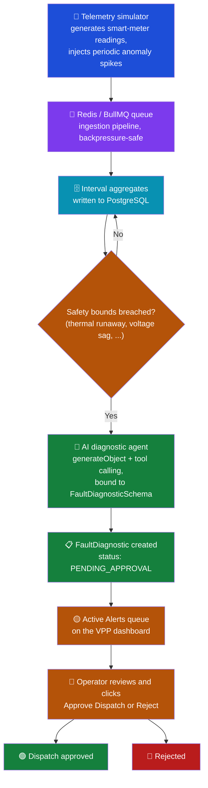

# gridstream-agent

**An event-driven IoT telemetry & Virtual Power Plant (VPP) diagnostic pipeline for green-tech energy assets** — solar, battery storage, heat pumps, EV wallboxes.

[](https://github.com/m-ahmedbashir/gridstream-agent/actions/workflows/ci.yml)
[](LICENSE)


[](CONTRIBUTING.md)

## Contents

- [Where this project is right now](#-where-this-project-is-right-now)
- [Target architecture](#-target-architecture)
- [Building an AI feature here](#-building-an-ai-feature-here)
- [Tech Stack](#-tech-stack)
- [Repo Structure](#-repo-structure)
- [Getting Started](#%EF%B8%8F-getting-started)
- [Deployment](#-deployment)
- [Contributing](#-contributing)
- [License](#-license)
- [About the Author](#-about-the-author)

## 📍 Where this project is right now

This repo is mid-pivot. It started as **maintain-agent**, an industrial maintenance-report planner (extract a machine profile from a PDF, match best-practice measures, generate an ROI-backed plan). That domain has been **deliberately and completely removed** — not deprecated, not hidden behind a flag, actually deleted — to make room for a new domain: an event-driven pipeline that ingests live telemetry from green-energy hardware and produces AI-assisted fault diagnostics with a human approving anything consequential before it happens.

**What survived the cleanup, because every future feature needs it regardless of domain:**
- Clerk authentication on the frontend
- A per-user settings model (model preference, BYOK provider key) backed by Postgres via Drizzle ORM
- A provider-agnostic AI model registry (`apps/api/src/common/ai/model-registry.ts`) — swap Groq/OpenAI/Anthropic/OpenRouter without touching a single feature's code
- AES-256-GCM encryption for user-supplied API keys

**What doesn't exist yet:** the actual VPP domain. No `DeviceAsset`/`TelemetryLog`/`FaultDiagnostic` tables, no ingestion pipeline, no diagnostic agent, no dashboard. [REFACTOR_PROGRESS.md](REFACTOR_PROGRESS.md) is the living log of what's been done stage-by-stage and what's still ahead — read it before assuming any domain feature exists.

---

## 🎯 Target architecture

The intended end-to-end flow, once the remaining stages land (tracked in [REFACTOR_PROGRESS.md](REFACTOR_PROGRESS.md)) — this diagram describes the *plan*, not current behavior:



The load-bearing constraint end to end: **the model never computes a number that gets acted on, and nothing consequential executes without a human clicking Approve.** Severity thresholds, financial estimates, and pass/fail safety checks are deterministic TypeScript; the model's job is qualitative diagnosis and tool orchestration only.

---

## 🧩 Building an AI feature here

This section exists so the folder structure for the next AI-calling feature isn't reinvented from scratch, and so it stays consistent as the codebase grows. It's also documented in [AGENTS.md](AGENTS.md) for coding agents working in this repo — this is the human-readable version.

### Start simple, add orchestration only when the task demands it

Most features in this codebase are, and should stay, a **single augmented call**: a prompt, the tools it needs, and a Zod schema constraining the output. Reach for a multi-step agent loop only when the model genuinely has to decide *which* tools to call and in *what order* for a problem whose steps can't be predicted ahead of time — not by default, and not because a loop looks more sophisticated than a function call. An unnecessary agent loop is more surface area to get wrong for a job a single structured call would already do.

### The folder shape for a new AI-calling module

```
apps/api/src/modules/<feature>/
  <feature>.module.ts
  <feature>.controller.ts        # HTTP surface only — validates, delegates, shapes the response
  <feature>.service.ts           # orchestration: builds the prompt, calls generateObject()/tool(), returns the result
  <feature>.service.spec.ts
  tools/
    <tool-name>.tool.ts          # one file per tool: a pure function + its own Zod input schema
    <tool-name>.tool.spec.ts     # pure functions — test them without ever touching the LLM
```

The output schema (what the model must return) and any request/response DTOs live in `packages/shared`, not inline in the service — one definition, imported by the backend to bind `generateObject` *and* by the frontend to type whatever renders the result. See [AGENTS.md](AGENTS.md#type-safety--single-source-of-truth-for-schemas) for the full single-source-of-truth rule.

### Rules that don't bend

- **One model registry, always.** `apps/api/src/common/ai/model-registry.ts` is the only place a provider SDK gets imported. A feature resolves a model through `resolveModel(key, apiKeyOverride?)` — never a second hardcoded provider client anywhere else.
- **Structured output, not parsed prose.** `generateObject()`/`tool()` bound directly to a Zod schema. Never `generateText()` plus hand-rolled JSON extraction — that pattern existed in the old domain and was a real source of bugs; it does not come back.
- **Tools are a public interface, not a grab-bag.** Each tool does one clearly-named thing with a minimal, precisely-typed input. A vague or overloaded tool produces vague or wrong tool calls from the model — the same discipline you'd put into a public API applies here.
- **The model never computes a fact.** Financial estimates, severity thresholds, anything that gets persisted or shown as ground truth is computed in deterministic TypeScript. The model writes prose around numbers it's handed, never numbers of its own.
- **Human-in-the-loop before anything consequential.** Any model output that would trigger a real-world action (a dispatch, an approval, an irreversible write) gets persisted in a pending state first. Nothing downstream executes without an explicit human action.

---

## 🛠 Tech Stack

- **Backend:** NestJS, PostgreSQL via **Drizzle ORM** (`drizzle-orm` + `pg` — not Prisma)
- **AI:** Vercel AI SDK, routed through a provider-agnostic model registry (Groq, OpenAI, Anthropic, OpenRouter)
- **Frontend:** Next.js 16 (App Router), Clerk auth, Tailwind CSS, shadcn/ui, TanStack Query
- **Validation:** Zod, shared between both apps via `packages/shared`
- **Auth:** Clerk (frontend-only — no backend session/RBAC layer yet)
- **Security:** AES-256-GCM for user-supplied (BYOK) provider API keys
- **Workspaces/Tooling:** pnpm, Turborepo, GitHub Actions

---

## 📁 Repo Structure

```text
gridstream-agent/
├── .github/
│   └── workflows/ci.yml        # typecheck + test on every push/PR
├── apps/
│   ├── web/                    # Next.js frontend — dashboard shell, Clerk auth, chat assistant
│   └── api/                    # NestJS backend
│       ├── drizzle.config.ts     # drizzle-kit config
│       ├── drizzle/              # generated SQL migrations — append-only
│       └── src/
│           ├── common/
│           │   ├── db/           # Drizzle schema.ts + DbService (pg Pool + Drizzle instance)
│           │   ├── crypto/       # BYOK AES-256-GCM encryption
│           │   └── ai/           # model-registry.ts — the only place a provider SDK is imported
│           └── modules/
│               └── users/        # Clerk-linked settings, BYOK key management
├── packages/
│   └── shared/                  # @maintain/shared — Zod schemas + types, shared by both apps
├── AGENTS.md                    # rules for any coding agent working in this repo
├── REFACTOR_PROGRESS.md         # stage-by-stage log of the maintain-agent → gridstream-agent pivot
├── turbo.json
├── LICENSE
├── CONTRIBUTING.md
└── CODE_OF_CONDUCT.md
```

For the full set of architectural rules (SOLID conventions, minimal-footprint feature guidelines, the AI-feature folder shape above in agent-facing form) see [AGENTS.md](AGENTS.md).

---

## ⚙️ Getting Started

### Prerequisites

- [Node.js](https://nodejs.org/) (v18+)
- [pnpm](https://pnpm.io/installation) (v10+)
- A PostgreSQL database (e.g. a free [Neon](https://neon.tech) or [Railway](https://railway.app) instance)

### Installation

```bash
git clone https://github.com/m-ahmedbashir/gridstream-agent.git
cd gridstream-agent
pnpm install
```

### Environment Variables

**Backend (`apps/api/.env`):**

```bash
cd apps/api
cp .env.example .env
```

Set `OPENROUTER_API_KEY` (free, no card required, from [openrouter.ai](https://openrouter.ai)) and `DATABASE_URL` (your PostgreSQL connection string).

**Frontend (`apps/web/.env`):**

```bash
cd apps/web
cp .env.example .env
```

Leave the Clerk keys empty to use Clerk's keyless dev mode, or populate `NEXT_PUBLIC_CLERK_PUBLISHABLE_KEY` / `CLERK_SECRET_KEY` from your Clerk dashboard.

### Database

```bash
pnpm db:generate    # generate SQL migrations from apps/api/src/common/db/schema.ts
pnpm db:migrate      # apply them to DATABASE_URL
```

### Running Locally

```bash
pnpm dev              # both apps via Turborepo
# or individually:
pnpm dev:frontend
pnpm dev:backend
```

### Running Tests & Typecheck

```bash
pnpm test           # all workspaces — same command CI runs
pnpm run typecheck  # tsc --noEmit across every workspace
```

---

## 🚀 Deployment

- **Frontend (Vercel):** Build: `pnpm build --filter=@maintain/frontend`
- **Backend (Railway):** Build: `pnpm build --filter=@maintain/backend`

(This is separate from the [CI workflow](.github/workflows/ci.yml) above, which typechecks and tests every push/PR — it doesn't deploy anything.)

---

## 🤝 Contributing

Issues and PRs are genuinely welcome. Before opening one:

- Read [CONTRIBUTING.md](CONTRIBUTING.md) — it covers setup and the pre-PR checklist (`pnpm run typecheck` + `pnpm test`, the same commands CI runs).
- This project follows the [Contributor Covenant Code of Conduct](CODE_OF_CONDUCT.md).
- Bug reports and feature requests have templates under `.github/ISSUE_TEMPLATE/`; PRs get a checklist template automatically.
- Given the repo is mid-pivot, check [REFACTOR_PROGRESS.md](REFACTOR_PROGRESS.md) first — it tracks exactly what exists, what's intentionally gone, and what's still ahead.

## 🙏 Acknowledgments

The frontend started from [next-shadcn-dashboard-starter](https://github.com/Kiranism/next-shadcn-dashboard-starter) by [Kiranism](https://github.com/Kiranism) (dashboard shell, shadcn/ui setup, auth scaffolding).

## 📄 License

[ISC](LICENSE) — see the [LICENSE](LICENSE) file for the full text.

## 👤 About the Author

Built by **Ahmed Bashir** — a full-stack engineer working across TypeScript, React, and Node.js, currently based in Bielefeld, Germany, and studying Intelligent Interactive Systems (AI/NLP focus) at Bielefeld University.

- GitHub: [github.com/m-ahmedbashir](https://github.com/m-ahmedbashir)
- Project: [github.com/m-ahmedbashir/gridstream-agent](https://github.com/m-ahmedbashir/gridstream-agent)
- LinkedIn: [linkedin.com/in/ahmed-bashir-2118651aa](https://www.linkedin.com/in/ahmed-bashir-2118651aa/)

Questions, feedback, or a role you think this'd be a good fit for — open an issue, or reach out directly.
